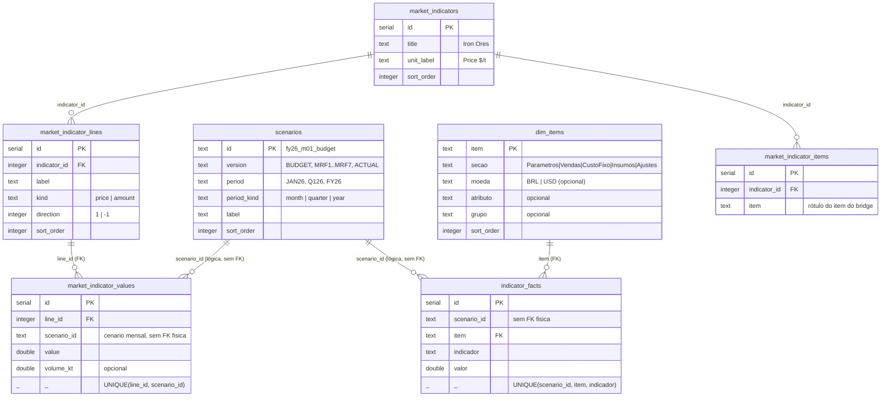

# Esquema do banco (PostgreSQL) — Bridge de EBITDA

Estado do banco após a reestruturação no modelo dimensional (modelo SAC).
Dois modelos de dados:

1. **Indicadores** — fonte do bridge: dimensão de itens + fato de indicadores;
2. **Explicações de mercado** — tabelas de referência (ex.: Iron Ores) com
   valores por versão × mês.

Ambos se apoiam na tabela comum `scenarios` (catálogo de cenários).

## Diagrama

As setas para `scenarios` são **referências lógicas** (o importador valida o
cenário antes de gravar): não há FK física em `scenario_id`. As FKs físicas
declaradas no banco são apenas `indicator_facts.item → dim_items.item` e as
FKs de `market_indicator_*` indicadas abaixo.

## Tabela comum: `scenarios`

Catálogo de cenários. Um cenário = uma versão dentro de um período.

| Coluna | Tipo | Regras |
|---|---|---|
| `id` | text | **PK**. Padrão `fy26_m01_budget` (mensal), `fy26_q1_mrf3` (trimestre), `fy26_fy_budget` (ano) |
| `version` | text | `ACTUAL`, `BUDGET`, `MRF1`…`MRF7` |
| `period` | text | `JAN26`…`DEC26`, `Q126`…`Q426`, `FY26` |
| `period_kind` | text | `month` \| `quarter` \| `year` |
| `label` | text | Rótulo de exibição |
| `sort_order` | integer | Ordem de exibição no seletor |

`period` é o formato **interno** de exibição (`JAN26` etc.) e não muda: o
contrato externo (Excel/Databricks/SAC) usa o padrão SAP SAC `YYYYMM`
(ex.: `202601`), convertido na importação/exportação.

Os **fatos são gravados somente em cenários mensais**. Os cenários de
trimestre e ano existem no catálogo, mas seus valores são derivados na
leitura: montantes e quantidades somando os meses; taxas (câmbio, preços de
insumos, participação de custo interno) como médias ponderadas.

## Modelo 1 — Indicadores

### `dim_items` (dimensão)

| Coluna | Tipo | Regras |
|---|---|---|
| `item` | text | **PK**. Chave global do item (produto, categoria de custo fixo, insumo, rótulo de ajuste; `Global` na seção Parametros) |
| `secao` | text | NOT NULL. `Parametros` \| `Vendas` \| `CustoFixo` \| `Insumos` \| `Ajustes` |
| `moeda` | text | NULL permitido. `BRL` ou `USD` (Vendas e CustoFixo) |
| `atributo` | text | NULL permitido. Vendas: `interno`/`externo`; Ajustes: `consumo`/`outros`/`variacao_estoque` |
| `grupo` | text | NULL permitido. Grupo de exibição (ex.: `Blacks`, `Reds`, `Controllable`) |
| `sort_order` | integer | NOT NULL, default 0. Ordem de exibição dos itens |

As propriedades de um item valem para **todas** as versões e períodos.
Membros sem nenhum fato são válidos (a dimensão é a fonte da verdade do
conjunto de itens).

### `indicator_facts` (fato)

| Coluna | Tipo | Regras |
|---|---|---|
| `id` | serial | PK técnica |
| `scenario_id` | text | NOT NULL. Cenário **mensal** (`fyNN_mMM_versao`). Referência lógica a `scenarios.id` — **sem FK física**; o importador valida antes de gravar |
| `item` | text | NOT NULL. **FK → `dim_items.item`** (ON DELETE CASCADE) |
| `indicador` | text | NOT NULL. Conta/medida (ver lista por seção em `docs/modelo-indicadores.md`) |
| `valor` | double precision | NOT NULL |
| — | — | **UNIQUE (`scenario_id`, `item`, `indicador`)** |

Granularidade: **versão × mês × item × indicador → 1 valor**.

### Tabelas largas legadas (somente leitura)

`scenario_params`, `sales_facts`, `fixed_cost_facts`, `input_price_facts` e
`misc_facts` são o formato antigo. Permanecem no esquema apenas para a
conversão automática de bancos já publicados (na primeira subida, o servidor
converte o conteúdo delas em `dim_items` + `indicator_facts`); **não recebem
mais escrita** e o painel não as lê.

## Modelo 2 — Explicações de mercado

### `market_indicators` (explicações)

| Coluna | Tipo | Regras |
|---|---|---|
| `id` | serial | PK |
| `title` | text | NOT NULL. Nome da explicação (ex.: `Iron Ores`) |
| `unit_label` | text | NOT NULL, default `Price $/t`. Unidade exibida no pop-up |
| `sort_order` | integer | NOT NULL, default 0 |

### `market_indicator_lines` (dimensão de linhas)

| Coluna | Tipo | Regras |
|---|---|---|
| `id` | serial | PK |
| `indicator_id` | integer | NOT NULL. FK → `market_indicators.id` (CASCADE) |
| `label` | text | NOT NULL. Rótulo da linha (ex.: `Iron ore MB 62% (1m lag)`). A identidade da linha é o par **explicação + rótulo** — o mesmo rótulo pode existir em explicações diferentes |
| `kind` | text | NOT NULL, default `price`. `price`: valor é preço, impacto = direction × Δ × kt; `amount`: valor é montante em MUSD, impacto = direction × Δ |
| `direction` | integer | NOT NULL, default −1. `+1` quando o aumento melhora o EBITDA; `−1` quando piora (custo) |
| `sort_order` | integer | NOT NULL, default 0 |

### `market_indicator_values` (fato)

| Coluna | Tipo | Regras |
|---|---|---|
| `id` | serial | PK |
| `line_id` | integer | NOT NULL. FK → `market_indicator_lines.id` (CASCADE) |
| `scenario_id` | text | NOT NULL. Cenário **mensal**. Referência lógica a `scenarios.id` — **sem FK física** |
| `value` | double precision | NULL permitido |
| `volume_kt` | double precision | NULL permitido (linhas `price`) |
| — | — | **UNIQUE (`line_id`, `scenario_id`)** |

Granularidade: **linha × versão × mês → 1 valor**. Diferenças entre cenários
e o impacto em $m são calculados na leitura, depois da seleção do par
origem × destino.

### `market_indicator_items` (vínculos)

| Coluna | Tipo | Regras |
|---|---|---|
| `id` | serial | PK |
| `indicator_id` | integer | NOT NULL. FK → `market_indicators.id` (CASCADE) |
| `item` | text | NOT NULL. Rótulo do item do bridge que abre o pop-up (ex.: `Fines`) |

## Tabelas auxiliares do app (fora dos dois modelos)

- `bridge_explanations` — comentários digitados pelo usuário para um par
  origem × destino (id, source_id, target_id, value_musd, text, created_at).
- `market_explanations`, `market_explanation_lines`,
  `market_explanation_items` — formato legado das explicações (por par de
  cenários); convertido automaticamente para o modelo por versão na primeira
  subida e não usado mais para escrita.

## Observações operacionais

- O servidor cria `dim_items`/`indicator_facts` no boot se não existirem
  (DDL aditiva serializada por advisory lock) e converte dados legados na
  própria base; se a conversão falhar, a subida aborta.
- Fonte da definição: `lib/db/src/schema/bridge.ts` (Drizzle ORM).
