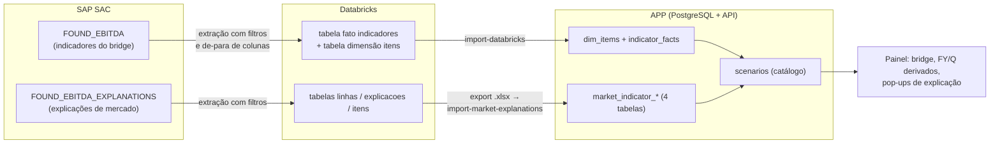

# Fluxo completo — SAP SAC → Databricks → APP (Bridge de EBITDA)

Documento de referência do fluxo de dados de ponta a ponta: como os dois
modelos reais criados no SAP SAC se estruturam, como extraí-los para as
tabelas do Databricks, como carregá-los no PostgreSQL do painel e quais
transformações o APP aplica na leitura.

Referências complementares:

- `docs/modelos-sac.md` — roteiro de criação dos modelos no SAC (contrato);
- `docs/modelo-indicadores.md` — contrato de importação do Modelo 1;
- `docs/esquema-banco.md` — esquema físico do PostgreSQL.

## Visão geral do fluxo



Princípios que valem para todo o fluxo:

- **A fonte é sempre mensal** (versão × mês `YYYYMM`). FY e trimestres nunca
  são carregados — o APP os deriva na leitura (seção 4.2).
- **Propriedades de dimensão são globais**: valem para todas as versões e
  meses; classificação que muda entre meses interrompe a carga.
- **Ordem de exibição** vem da dimensão (`sort_order`), obrigatória nas
  tabelas do Databricks.
- Versões aceitas pelo APP: `ACTUAL`, `BUDGET`, `MRF1`…`MRF12` (a importação
  normaliza `MRF01`→`MRF1` … `MRF09`→`MRF9`; `MRF10`…`MRF12` permanecem).
  O ano não é fixado em `FY26`: períodos SAC/Databricks `YYYYMM` são aceitos
  para qualquer ano dentro da validação do contrato (2000–2099).

---

## 1. Modelos reais no SAC

### 1.1 Modelo 1 — `FOUND_EBITDA` (indicadores do bridge)

Estrutura efetivamente criada no SAC:

| Elemento | Conteúdo real | Papel na extração |
|---|---|---|
| Dimensão de conta (keyfigures) | 10 contas: `cambio_brl_usd`, `cambio_custo_fixo_brl_usd`, `aco_bruto_kt`, `ebitda_kusd`, `participacao_custo_interno`, `quantidade_kt`, `montante_kusd`, `custo_variavel_kusd`, `preco_usd_t`, `fator_rendimento` | vira a coluna `indicador` |
| Dimensão **`DBR_ITEM_EBITDA`** | 63 membros = 62 itens do APP + `Unassigned`; propriedades `Seção`, `Moeda`, `Atributo`, `Grupo`, `Ordenação` | vira a tabela de itens; `Unassigned` NÃO é extraído |
| Dimensão **Version** | `Actual`, `BUDGET_2026`, `MRF07_2026`, `MRF08_2026`…`MRF12_2026` com **propriedade "Versão"** = de-para para o APP (`BUDGET_2026`→`BUDGET`, `MRF07_2026`→`MRF7`, `MRF12_2026`→`MRF12`; `Actual`→`ACTUAL`) | a coluna `versao` extraída é a **propriedade**, nunca o ID do membro |
| Dimensão **Date** | mensal, `YYYYMM` | vira `periodo` |
| **`DBR_MOEDA`** | membro único `USD` | técnica — fixar/ignorar |
| **`DBR_EMPRESA`** | membro único `BMJF` | técnica — fixar/ignorar |
| **`DBR_AUDITORIA`** e **`DBR_VTYPE`** | dimensões técnicas do SAC | **filtrar para UM membro na extração** — sem o filtro a mesma célula sai duplicada e a carga aborta por violação de unicidade |

### 1.2 Modelo 2 — `FOUND_EBITDA_EXPLANATIONS` (explicações de mercado)

| Elemento | Conteúdo real | Papel na extração |
|---|---|---|
| Dimensão de conta **`INDICADOR`** | contas `valor` e `kt`, medida única `VALUE` | viram as colunas `valor` e `kt` da fato |
| Dimensão de linhas | **ID do membro = o próprio rótulo da linha** (ex.: `Freight`), com propriedade **"Explanation EBITDA"** = nome da explicação (ex.: `Iron Ores`), mais `tipo`, `sentido`, `unidade`, `Ordenação` | ID → coluna `linha`; propriedade → coluna `explicacao` |
| Dimensão **`DBR_ITEM_EXPLANATION_EBITDA`** | dimensão de vínculo independente (`C_EXPL` → itens de `DBR_ITEM_EBITDA`) | espelha a tabela de vínculos explicação → item |
| Version / Date / técnicas | idênticas ao Modelo 1 (mesmo de-para de versão, mesmos filtros técnicos) | idem |

> **Decisão registrada — ID da linha é o rótulo puro.** O contrato documentado
> originalmente em `docs/modelos-sac.md` previa ID composto
> `<explicacao>|<linha>`; o modelo real usa o rótulo simples como ID, com a
> explicação em propriedade. **Premissa assumida:** os rótulos de linha são
> globalmente únicos entre todas as explicações. Se no futuro duas explicações
> precisarem de linhas com o mesmo rótulo (ex.: `Freight` em Iron Ores e em
> Coal), será necessário migrar para o ID composto. Nas demais pontas
> (Databricks/Excel/Postgres) nada muda: a chave segue sendo o par
> `explicacao` + `linha` em duas colunas.

Valores de referência atuais da dimensão de linhas (batidos com o banco):
6 linhas de preço com `sentido = −1`, `Netback freight` com `sentido = +1`,
`Forex & Others` com `tipo = valor` (montante MUSD) e `sentido = −1`; unidade
`Price $/t`; ordem do painel: 62%, 65%, Pellet, Rebate, Lump, Netback, Forex,
Others.

---

## 2. Extração SAC → Databricks

### 2.1 Regras comuns

1. **Filtrar as dimensões técnicas** (`DBR_AUDITORIA`, `DBR_VTYPE`) para um
   único membro cada. `DBR_MOEDA` e `DBR_EMPRESA` têm membro único, mas devem
   igualmente ficar fora das colunas extraídas.
2. **`versao` = propriedade "Versão" da dimensão Version** (de-para
   `BUDGET_2026`→`BUDGET`, `MRF08_2026`→`MRF8` etc.), nunca o ID do membro.
   O de-para deve resultar em `ACTUAL`, `BUDGET` ou `MRF1`…`MRF12`; qualquer
   outra versão fica fora da extração.
3. **`periodo` = Date em `YYYYMM`** (ex.: `202601`), só meses.
4. **`sort_order`** vem da propriedade de ordenação da dimensão e é
   obrigatória nas tabelas de dimensão do Databricks.
5. Membro `Unassigned` e células vazias não são extraídos.

### 2.2 Modelo 1 — de-para de colunas

Tabela de itens (dimensão):

| SAC (`DBR_ITEM_EBITDA`) | Coluna Databricks |
|---|---|
| ID do membro | `item` |
| propriedade Seção | `secao` |
| propriedade Moeda | `moeda` |
| propriedade Atributo | `atributo` |
| propriedade Grupo | `grupo` |
| propriedade Ordenação | `sort_order` |

Tabela fato (indicadores):

| SAC | Coluna Databricks |
|---|---|
| Version → propriedade "Versão" | `versao` |
| Date (`YYYYMM`) | `periodo` |
| membro `DBR_ITEM_EBITDA` | `item` |
| conta (keyfigure) | `indicador` |
| valor da célula | `valor` |

### 2.3 Modelo 2 — de-para de colunas

Tabela de linhas (dimensão):

| SAC (dimensão de linhas) | Coluna Databricks |
|---|---|
| propriedade "Explanation EBITDA" | `explicacao` |
| ID do membro (= rótulo) | `linha` |
| propriedade tipo | `tipo` (`preco`/`valor`) |
| propriedade sentido | `sentido` (1/−1) |
| propriedade unidade | `unidade` |
| propriedade Ordenação | `sort_order` |

Tabela fato (explicações): `versao`, `periodo`, `explicacao`, `linha`,
`valor` (conta `valor`), `kt` (conta `kt`, só linhas de preço).

Tabela de vínculos (de `DBR_ITEM_EXPLANATION_EBITDA`): `explicacao`, `item`.

---

## 3. Carga no APP (Databricks/Excel → PostgreSQL)

### 3.1 Modelo 1 — importador direto do Databricks

```
pnpm --filter @workspace/scripts run import-databricks <catalogo.schema.fato> [catalogo.schema.itens]
```

(ou variáveis `DATABRICKS_INDICADORES_TABLE` / `DATABRICKS_ITENS_TABLE`).

- Credenciais via conector Replit **"Databricks (Service Principal)"**
  (`databricks-m2m`) — nunca tokens em variáveis. Se o conector não trouxer o
  warehouse, defina `DATABRICKS_WAREHOUSE_ID`.
- Mesmo núcleo de validação do Excel (`import-indicadores`); erros apontam o
  registro problemático (`Registro N: …`) e **nada é gravado** em caso de
  falha.

Validações que abortam a carga (mensagens típicas):

| Situação | Mensagem típica |
|---|---|
| versão fora da lista | `versão inválida "MRF13"` (lista aceita: ACTUAL, BUDGET, MRF1…MRF12) |
| período não mensal / formato inválido | período rejeitado (aceitos: `YYYYMM` mês 01–12, ano 2000–2099; legado `JAN26`…) |
| item da fato fora da dimensão | item desconhecido — a dimensão é a fonte da verdade |
| propriedade em conflito (fato × dimensão, ou item com classificação diferente entre linhas) | conflito de propriedade interrompe a carga |
| `sort_order` ausente/duplicada na tabela de dimensão | coluna obrigatória no Databricks |
| indicador incompatível com a seção | ex.: `preco_usd_t` em item de Vendas |
| valor não numérico / célula duplicada | erro com `Registro N` |

### 3.2 Modelo 2 — via Excel (sem importador Databricks direto)

**Pendência conhecida:** `import-databricks` cobre só o Modelo 1. O caminho
operacional do Modelo 2 é exportar as três tabelas do Databricks para um
`.xlsx` com abas **"Linhas"** (ordenada por `sort_order`), **"Explicacoes"**
e **"Itens"**, e rodar:

```
pnpm --filter @workspace/scripts run import-market-explanations [caminho.xlsx]
```

Validações próprias além das comuns: `|` proibido em `explicacao` e `linha`;
par `explicacao`+`linha` duplicado dentro da mesma explicação aborta;
`unidade` deve ser igual em todas as linhas da mesma explicação; defaults
`tipo=preco`, `sentido=−1`.

### 3.3 Exports de referência

- `pnpm --filter @workspace/scripts run export-indicadores` →
  `exports/Fonte_Indicadores_Bridge_EBITDA.xlsx` (abas "Itens"/"Indicadores");
- `pnpm --filter @workspace/scripts run export-market-explanations` →
  `exports/Explicacoes_Mercado_Bridge_EBITDA.xlsx` (abas
  "Linhas"/"Explicacoes"/"Itens").

Esses exports são arquivos de **referência/backup em formato de importação**
— eles NÃO alimentam a produção.

### 3.4 Seed de produção (atenção ao publicar)

Na publicação, o servidor semeia um banco de produção **vazio** a partir do
JSON embutido `artifacts/api-server/src/seed/bridge-seed.json` (chaves
`scenarios`, `dim_items`, `indicator_facts`, `market_indicators`), sob
advisory lock. **Não existe hoje comando automatizado que regenere esse
JSON**: os exports Excel acima não o atualizam. Após reimportar dados no
desenvolvimento, o `bridge-seed.json` precisa ser regenerado manualmente
(dump das tabelas do banco de desenvolvimento para o mesmo formato JSON) e
commitado antes de publicar — caso contrário a produção sobe com os dados
antigos do seed. Esse mesmo JSON alimenta os testes (`seed-fixture.ts`), que
assim acompanham o formato dos dados reais.

---

## 4. Transformações dentro do APP

### 4.1 Criação do `scenario_id`

Cada linha da fato chega como `versao` + `periodo` e vira um cenário mensal
no catálogo `scenarios`:

```
BUDGET + 202601  →  fy26_m01_budget   (label "JAN26 Budget")
MRF7   + 202607  →  fy26_m07_mrf7     (label "JUL26 MRF7")
```

Regra: `fy{AA}_m{MM}_{versao minúscula}`; ordenação do seletor
`10000 + (índice da versão + 1) × 100 + (mês − 1)`. Internamente
`scenarios.period` guarda o formato de exibição `JAN26`; o `YYYYMM` existe só
no contrato externo. O catálogo tem uma linha por versão × mês: com as 14
versões aceitas (ACTUAL, BUDGET, MRF1…MRF12) × 12 meses são até 168 cenários
mensais. A quantidade efetiva depende das versões/meses recebidos do
Databricks.

### 4.2 Derivação de FY e trimestres (indicadores)

FY/Q **não são gravados**: são cenários derivados na leitura
(`fy26_q1_budget`, `fy26_fy_mrf7`…), consolidando os meses ("consolidar
primeiro", depois calcular o bridge):

| Grandeza | Regra de consolidação |
|---|---|
| quantidades, montantes, custos, EBITDA, aço bruto | soma dos meses |
| câmbio geral (`cambio_brl_usd`) | média ponderada pela **receita doméstica** de cada mês |
| câmbio do custo fixo | média ponderada pelos **custos fixos em BRL** |
| participação do custo interno | média ponderada pelo **custo** (\|EBITDA − receita\|) |
| preço de insumo (`preco_usd_t`) | média ponderada pelo **consumo mensal** (rendimento × aço bruto) |
| rendimento (`fator_rendimento`) | média ponderada pelo **aço bruto** |

Exemplo: FY26 Budget = soma dos 12 `fy26_m01_budget`…`fy26_m12_budget`; o
câmbio FY não é a média simples dos 12 câmbios, e sim ponderado pela receita
doméstica de cada mês.

Salvaguardas:

- um FY/trimestre só "tem dados" quando **todos** os meses do período têm
  dados (nunca consolida período parcial);
- classificação de item inconsistente entre meses (moeda/atributo/flag
  USD/formato de insumo) aborta a consolidação — última linha de defesa, a
  importação já barra isso;
- um insumo não pode misturar formato precificado e montante entre meses.

### 4.3 Reconstrução das visões largas

O painel lê `dim_items` + `indicator_facts` e reconstrói na memória as formas
largas legadas (parâmetros, vendas, custo fixo, insumos, ajustes) por
cenário. Cenário sem os 5 parâmetros obrigatórios é pulado; um cenário só
conta como "com dados" com parâmetros **e** ao menos uma linha de vendas.

### 4.4 Cálculo do bridge

Para um par origem × destino, `computeBridge` decompõe a variação do EBITDA:
câmbio duplo (taxa geral × taxa do custo fixo), efeito preço de itens BRL
calculado em moeda local, volume & mix sobre a margem de contribuição da
origem, efeitos de insumos (Δpreço × rendimento × aço bruto para
precificados; destino − origem para diretos) e plug de variação de estoque
que fecha a ponte exatamente. Referência atual:
`fy26_fy_budget` 632.044 → `fy26_fy_mrf7` 747.692.

### 4.5 Impacto das explicações (pop-ups)

O impacto em $m **não é armazenado** — é calculado na leitura, por mês:

```
linha de preço:    impacto = sentido × (valor destino − valor origem) × kt do mês DESTINO
linha de montante: impacto = sentido × (valor destino − valor origem)
```

**Nenhuma conversão de unidade é aplicada**: o produto Δvalor × kt já deve
estar na escala exibida ($m) — a fonte é responsável por carregar `valor` e
`kt` em escalas compatíveis. Exemplo: linha com sentido −1, origem 100 $/t,
destino 110 $/t, kt destino 0,5 → impacto = −1 × 10 × 0,5 = **−5,0 $m**
(custo subiu, EBITDA piora). Linha de preço sem `kt` no mês destino não gera
impacto naquele mês.

Para pares FY/trimestre o painel expande o par em pares mensais (mês i da
origem ↔ mês i do destino), calcula cada mês e:

- **soma** impactos e kt;
- exibe preço origem/destino como **média ponderada pelo kt** do próprio
  lado, usando só meses com valor dos dois lados; `Var` = diferença das
  médias (o impacto continua sendo a soma mensal — a aproximação
  Var × kt total pode divergir por mix);
- granularidades diferentes (FY × trimestre) não são comparadas — sem soma
  parcial.

---

## 5. Checklist operacional do ciclo mensal

1. **SAC**: carregar/atualizar os dados do mês nas versões pertinentes dos
   dois modelos; conferir que novos itens/linhas ganharam propriedades e
   Ordenação.
2. **Extração**: rodar a extração SAC → Databricks com os filtros técnicos
    (`DBR_AUDITORIA`/`DBR_VTYPE` em um membro) e o de-para de versão pela
    propriedade "Versão"; carregar somente `ACTUAL`, `BUDGET` e `MRF1`–`MRF12`.
3. **Modelo 1**: `import-databricks <fato> <itens>`; em erro, corrigir o
   registro apontado e repetir (nada parcial é gravado).
4. **Modelo 2**: exportar as três tabelas para `.xlsx` (Linhas ordenadas por
   `sort_order`) e rodar `import-market-explanations`.
5. **Conferência no painel**: bridge fecha sem discrepância inesperada;
   FY/trimestres habilitados (todos os meses com dados); pop-ups de
   explicação batem com o SAC.
6. **Publicação**: regenerar e commitar
   `artifacts/api-server/src/seed/bridge-seed.json` a partir do banco de
   desenvolvimento (ver seção 3.4 — não há comando automatizado; os exports
   Excel NÃO atualizam o seed) e, opcionalmente, atualizar os exports de
   referência (`export-indicadores` / `export-market-explanations`).

## Pendências conhecidas (resumo)

- **Modelo 2 sem importador Databricks direto**: caminho via Excel (seção
  3.2).
- **ID de linha = rótulo puro no SAC**: exige rótulos globalmente únicos
  entre explicações (seção 1.2).
